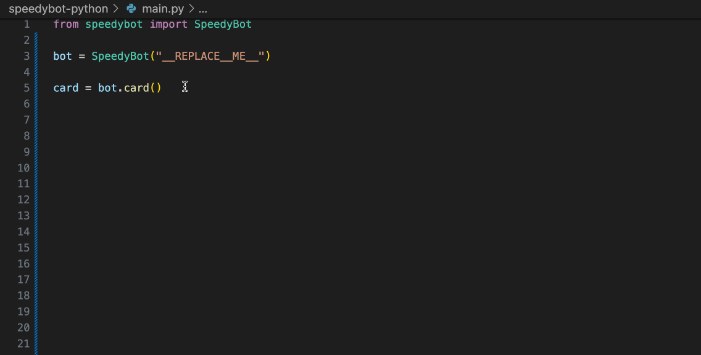

## Speedybot-python

SpeedyBot takes a daring leap into Python with speedybot-python! 🚀

While SpeedyBot has always been a TypeScript champion, the goal of SpeedyBot is to meet the conversation design needs of those seeking simple, easy-to-use, zero-dependency, lightweight, beginner-friendly tooling that seamlessly operates on any infrastructure.

More to come, keep your eyes for updates on https://speedybot.js.org



## Getting Started

```
pip install speedybot
```

## Quickstart

```python
from speedybot import SpeedyBot

## Setup/import your bot
## Get a bot token here: https://developer.webex.com/my-apps/new/bot
bot = SpeedyBot("__REPLACE__ME__"))

## Send Messages
messsage = bot.send_to("valgaze@cisco.com", "here is **my message**")

## Reply to Messages
roomId = messsage['roomId']
messageId = messsage['id']

bot.reply(roomId, messageId, 'This is a reply')

## Cards + fun
# More info: https://developer.webex.com/docs/buttons-and-cards

card = bot.card() \
    .add_title('Earnest Shackleton Expedition') \
    .add_subtitle('Survival in the Antarctic Wilderness') \
    .add_text("As we embarked on the Earnest Shackleton Expedition, our success hinged on the equipment we carried. "
              "Our inventory was meticulously chosen to ensure our survival in the harsh Antarctic wilderness and guide us through "
              "uncharted territories. Here's what we packed:",
              horizontalAlignment="Center", color="Accent") \
    .add_table([
        ['Equipment', 'Quantity'],
        ['Maps', '2'],
        ['Compasses', '2'],
        ['Torches', '4'],
        ['Provisions', '10 months'],
        ['Rope', '50 meters'],
        ['First Aid Kit', '1'],
    ]) \
    .add_text("With these supplies, we were well-prepared to face the challenges that lay ahead") \
    .addLink('https://en.wikipedia.org/wiki/Ernest_Shackleton', 'Explore Earnest Shackleton Expedition') \

# card inside a card
sub_card = bot.card() \
        .add_subtitle('The Harsh Antarctic Wilderness') \
        .add_text("The Earnest Shackleton Expedition took us to the unforgiving Antarctic wilderness, filled with extreme cold, isolation, and constant danger. "
                  "Our survival equipment was our lifeline in these remote landscapes, ensuring our safety and "
                  "enabling us to explore the unknown with confidence")

card.add_subcard(sub_card)
bot.send_to('valgaze@cisco.com', card)

```
